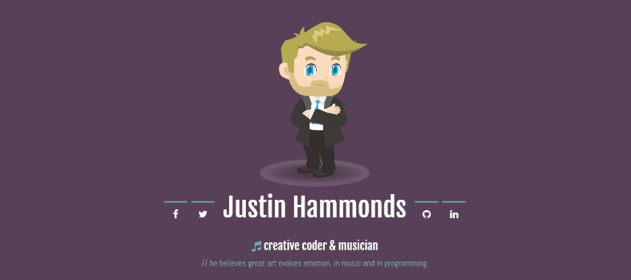

## My Web Development Portfolio

This was my first project developed at Coder Foundry. In it's design I capitalized on my past experience using basic 
HTML, CSS, JS, jQuery and Boostrap to create a visually stunning portfolio to showcase my work.

It's fully responsive and compatible in all major browsers. I even 
got to experiment in editing a vector illustration in my likeness!

